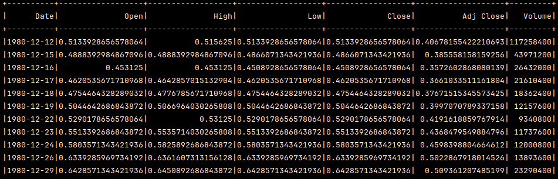
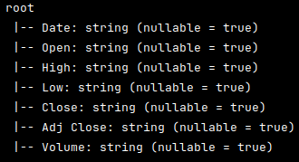
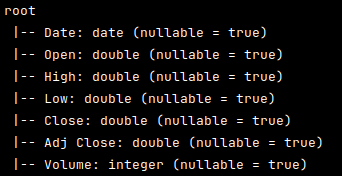

# Apache Spark and Scala

- Spark Session is the entry point for the "Spark world" in the Scala application
```scala
SparkSession.builder()
      .appName("spark-video-course")
      .master("local[*]")
      .getOrCreate()
```
- the `*` means that the Spark will create a number of executors according the available core numbers 

### Add VM Options (Intellij)
`--add-exports java.base/sun.nio.ch=ALL-UNNAMED`

## Data Frame
- `type DataFrame = Dataset[Row]`
- `Row` is a generic object (untyped view)
> We can think a data frame as being a **collection** of generic rows, so we have many rows like you would have in a SQL table or in a list in Scala

### show


### printSchema
- [SQL data types reference](https://spark.apache.org/docs/latest/sql-ref-datatypes.html)
- [CSV data source](https://spark.apache.org/docs/latest/sql-data-sources-csv.html)

All columns are recognized as string because the `inferSchema` default value is false  



To infers the input schema automatically from data, we need to set the `inferSchema` as true



> If at least one value of the column has a different type, all column will be a string

## Dataset
- It's the main abstraction introduced by Spark SQL
- Spark SQL is an abstraction over Spark core's RDD
- The Dataset API defines a DSL (domain-specific language, declarative, not using Scala functions)
    - that's how we tell Spark what to do

## SQL Expressions
- We can write SQL expressions as strings to create columns, which will be interpreted at runtime (no compiler safety)
- [SQL built-in functions](https://spark.apache.org/docs/latest/api/sql/)

---
Reference: [Apache Spark & Scala Course](https://www.youtube.com/watch?v=l9vuR2SPGGQ&list=PLeEh_6coH9EpIwsiNiDCW0V-UjNZElF0d)
